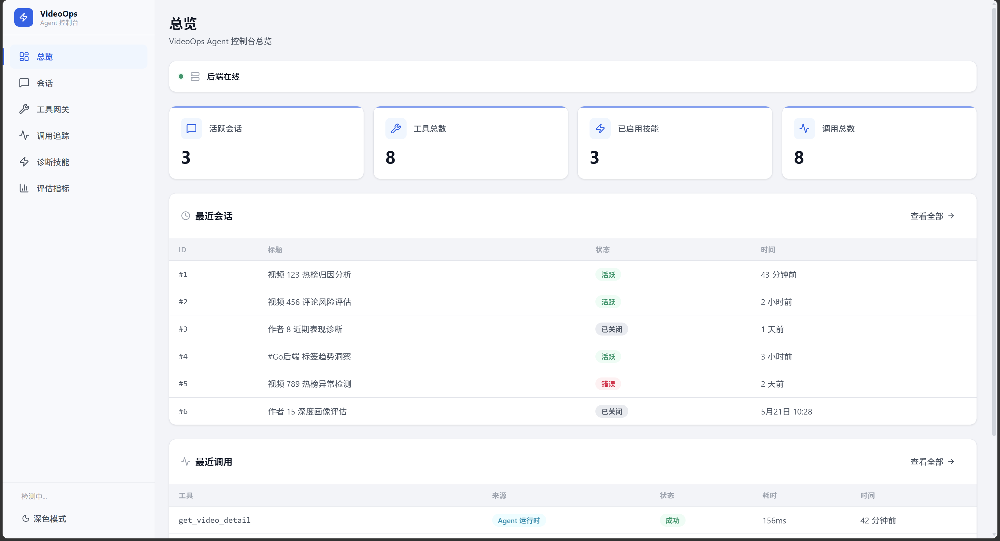
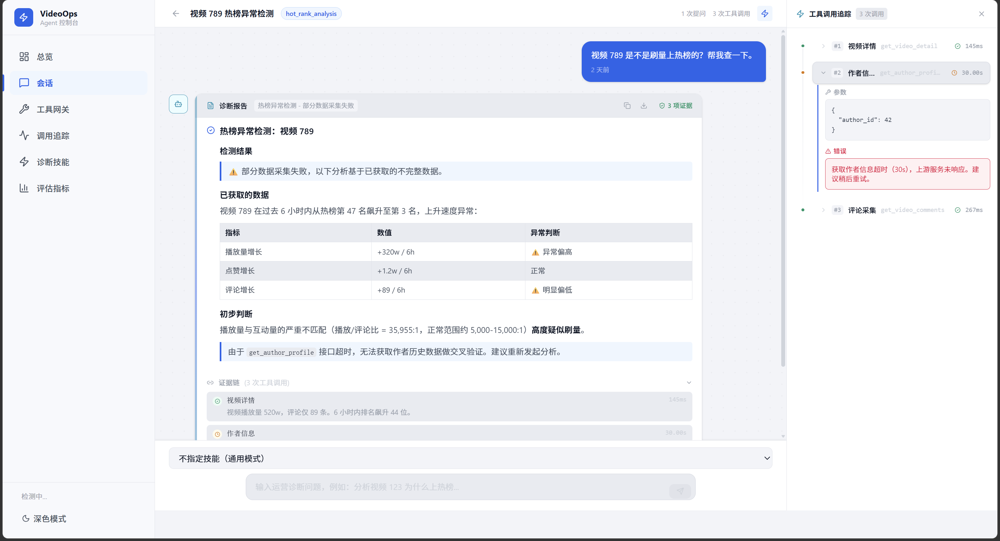
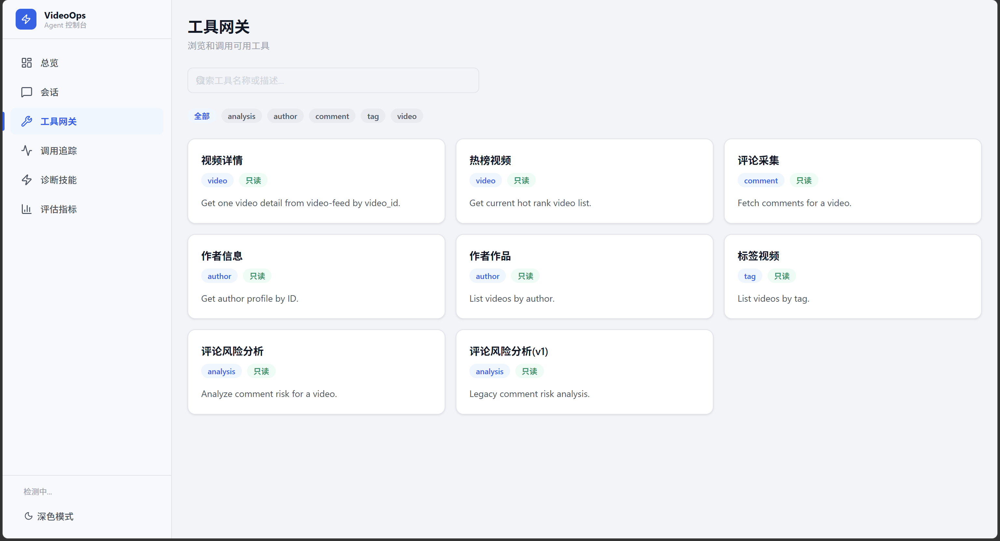
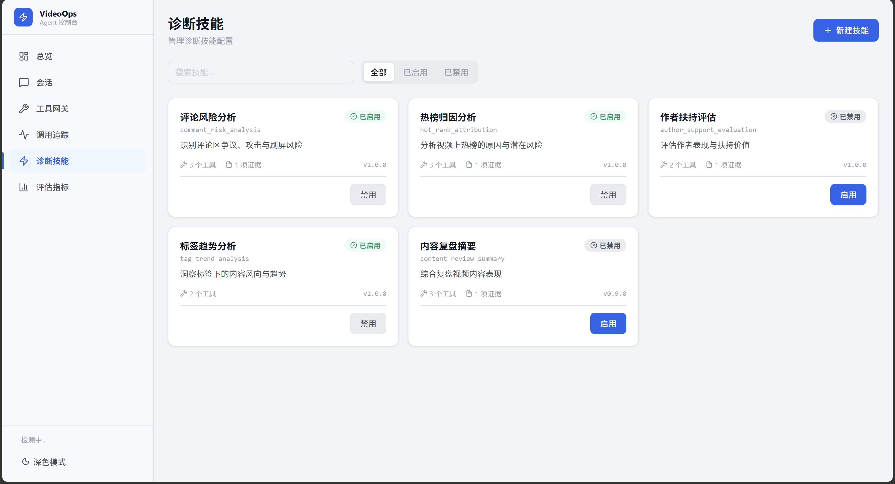
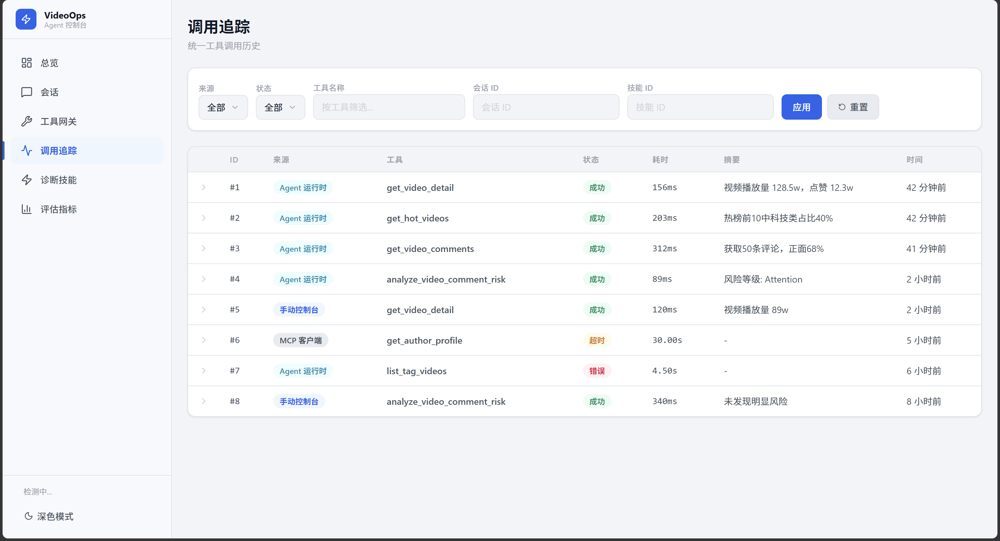
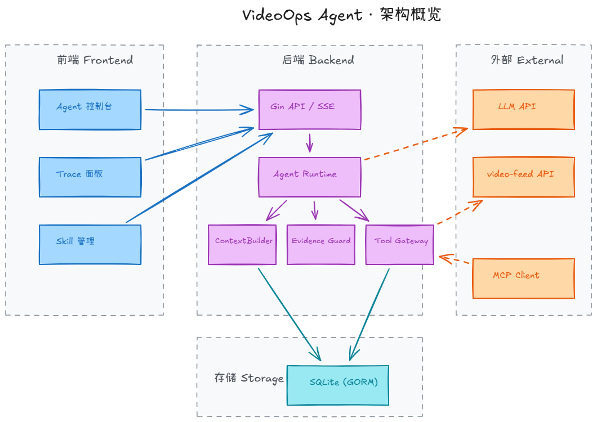
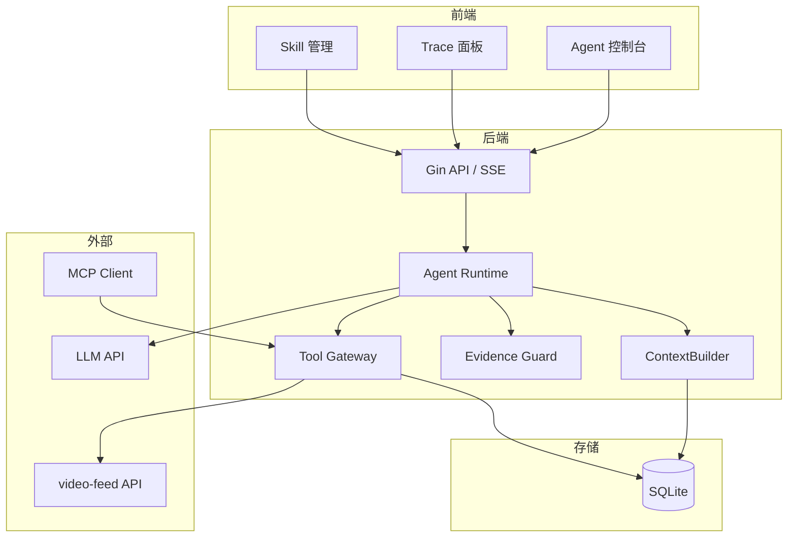

# VideoOps Agent

面向短视频内容运营分析的 Go 后端服务 + React 控制台。将 `video-feed` 平台的只读能力封装为 Function Calling 工具，通过 Agent Runtime、Evidence Guard、Diagnosis Skills 和 MCP 适配器，实现从数据拉取到分析结论的端到端闭环。

> 配套平台：[video-feed（短视频社区后端）](https://github.com/junnhwan/video-feed)

## 技术栈

| 层 | 技术 |
|---|:--|
| 后端框架 | Go 1.26, Gin |
| 存储 | SQLite (GORM) |
| LLM 接入 | OpenAI-compatible Chat Completions API |
| Agent 编排 | Function Calling, Evidence Guard, Diagnosis Skills |
| MCP 扩展 | JSON-RPC 2.0 over stdio |
| 前端 | React 19, TypeScript, Vite, TailwindCSS, SSE |
| 评测 | A/B 批量 CLI + Markdown 报告 |

## 核心亮点

- **工具注册与执行治理**：统一管理工具 Schema、JSON 严格解码、参数校验、执行超时、结果摘要和结构化落库；自建评测集（24 条 / 4 类场景）**工具调用成功率 100%**
- **Evidence Guard 证据完整性校验**：在生成最终结论前校验必需工具证据是否齐全，缺失时自动注入重试指令；**必需证据完整率从 70.8% 提升至 95.8%**
- **Skill 化分析模板**：按运营场景配置工具白名单、必需证据、输出章节和风险提示，运行时限制 LLM 可见工具集合；**越权工具调用率从 26.2% 降至 0%**
- **统一调用轨迹**：Agent 自动调用、控制台手动调用、MCP 客户端调用写入同一张轨迹表，记录 Skill 标识、版本、状态、耗时和结果摘要
- **A/B 评测框架**：CLI 批量对比 baseline vs skill+guard 模式，输出 Markdown 报告（失败率、证据完整率、越权率、章节命中率等指标）

## 演示

> 截图统一存放于 `docs/screenshots/`

### 控制台主界面与会话





### Skill 化分析与只读 Tools（热榜归因 / 评论风险）

选择对应 Skill 后，LLM 仅可见白名单工具，按预设章节输出结论。





### 调用轨迹

每次工具调用记录来源（Agent / 手动 / MCP）、Skill 标识、版本、状态、耗时和结果摘要。



## 架构概览



实线为同步调用，虚线为跨进程依赖（LLM / video-feed / MCP）。

<details>
<summary>Mermaid 源（点击展开）</summary>



</details>

## 能力清单

8 个只读工具：

| 工具 | 说明 |
|---|---|
| `get_video_detail` | 查询视频详情 |
| `get_hot_videos` | 获取热榜视频列表 |
| `get_video_comments` | 查询视频评论 |
| `get_author_profile` | 查询作者画像 |
| `list_author_videos` | 查询作者视频列表 |
| `list_tag_videos` | 查询标签下视频列表 |
| `analyze_video_comment_risk` | 评论风险分析（拉取 + 分析） |
| `analyze_comment_risk` | 评论风险分析（仅分析） |

5 个 Diagnosis Skill（分析模板）：

| Skill | 场景 |
|---|---|
| `hot_rank_attribution` | 热榜归因分析 |
| `comment_risk_analysis` | 评论风险分析 |
| `author_support_evaluation` | 作者扶持评估 |
| `tag_trend_analysis` | 标签趋势分析 |
| `content_review_summary` | 内容复盘摘要 |

每个 Skill 定义：工具白名单、必需证据、Prompt 模板、输出章节、风险提示。支持 CRUD 管理和启用/禁用。

## 三个入口

| 入口 | 命令 | 说明 |
|---|---|---|
| HTTP API | `go run ./cmd/server` | Gin 服务，前端控制台 + REST API |
| MCP Server | `go run ./cmd/mcp-server` | stdio JSON-RPC，供 Claude Desktop 等 MCP 客户端调用 |
| Eval Batch | `go run ./cmd/eval-batch` | CLI 批量 A/B 评测，输出 Markdown 报告 |

## 快速启动

<details>
<summary>展开环境依赖与启动命令</summary>
### 环境依赖

- Go 1.26.1
- Node.js / npm
- 本地运行中的 [video-feed](https://github.com/junnhwan/video-feed) API（默认 `http://127.0.0.1:8080`）
- OpenAI 兼容 Chat Completions 服务

### 后端

创建本地配置 `configs/config.yaml`（不提交）：

```yaml
server:
  address: "127.0.0.1:8090"

database:
  dsn: "data/video-ops-agent.db"

llm:
  base_url: ""
  model: ""
  api_key_env: "VIDEO_OPS_LOCAL_LLM_API_KEY"

video_feed:
  base_url: "http://127.0.0.1:8080"
```

```bash
export VIDEO_OPS_LOCAL_LLM_API_KEY="<your-key>"
export CONFIG_PATH="configs/config.yaml"
go run ./cmd/server
# health check: curl http://127.0.0.1:8090/health
```

### 前端

```bash
cd web
npm install
npm run dev
# http://127.0.0.1:3000
```

Vite 会将 `/api` 代理到后端 `http://127.0.0.1:8090`。

</details>
